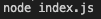
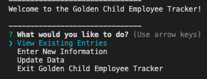
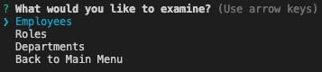
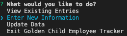
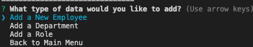
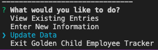
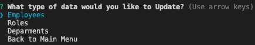
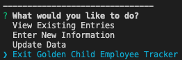

# Golden Child Employee Tracker

## This node-based command-line application is designed to allow you to better keep track of your business structure. You can View, Create, Update, and Delete lists of Deparments, Roles, and Employees

[Click Here to Watch A Tutorial](https://www.youtube.com/watch?v=ZGkva1f8srE&feature=youtu.be)

Start by navigating to the app's main directory in the console, and run "node index.js"

You will then be presented with the Starting Menu

Select View Existing Entries to view data present in the database

You can then select between the three data types: Employees, Roles, and Departments

Select Enter New Information to add data to the database

You can then select between the three data types: Employees, Roles, and Departments

Select Update Data to alter existing entries on the database

You can then select between the three data types: Employees, Roles, and Departments

To close the application, select Exit Golden Child Employee Tracker

